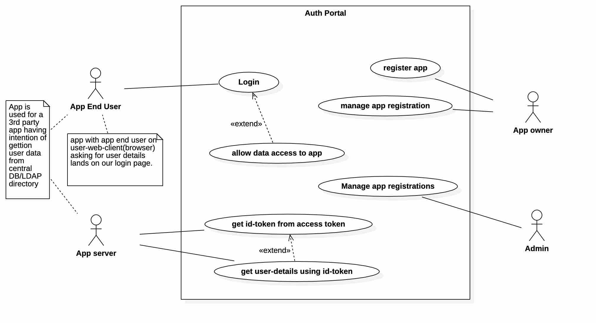

# Authentication Portal
IITJ Software Engineering Project: OAuth/openid based authentication portal
- [Use Case Diagram](#use-case-diagram-extended-scenario)
- [Login Sequence](#login-sequence-with-oauthopenid)
- [Class Diagram of The Project](#class-diagram-of-the-project)
- [NPM Scripts](#npm-scripts)
# Use Case Diagram (Extended Scenario)
<p align="center">

</p>

# Login Sequence with oauth/openid
<p align="center">

</p>

# Class Diagram of The Project
<p align="center">

</p>

# NPM Scripts

 1. **Lint Test**
	```sh
	$ npm run lintTest
	```

2. **Lint**
	```sh
	$ npm run lint
	```

3. **Build**
	```sh
	$ npm run build
	```

4. **Tests**
	```sh 
	# Without build & coverage
	$ npm run localTests

	# Without build
	$ npm run localTestsWithCoverage

	# With build and Coverage
	$ npm test
	```

5.  **Start Dev Server**
	```sh
	$ npm start
	```
